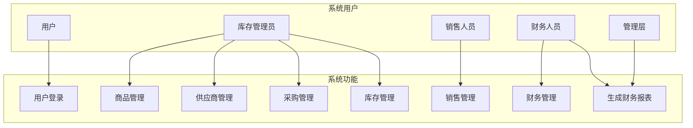
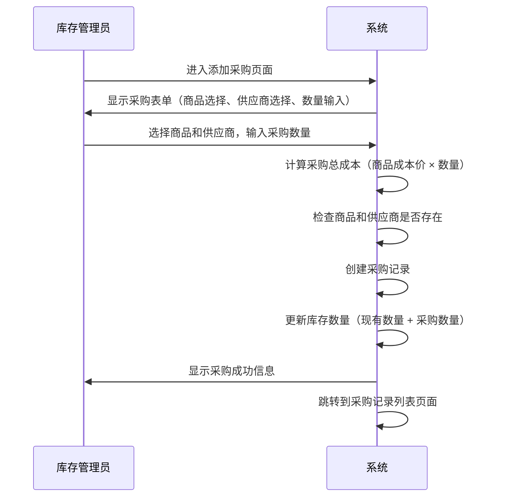
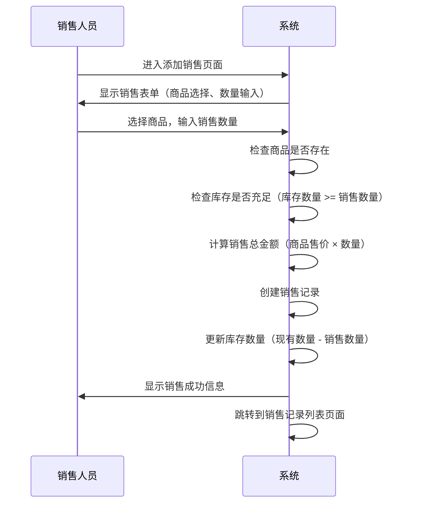
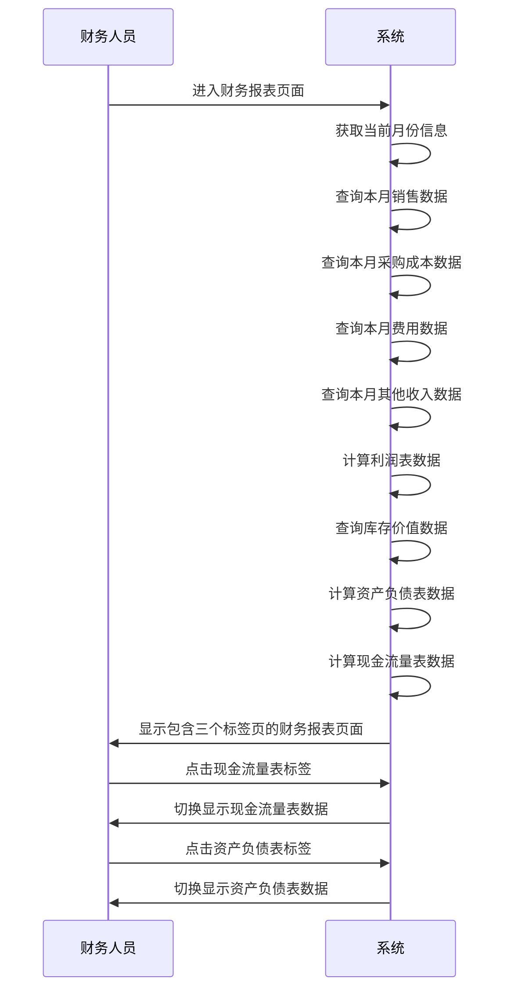
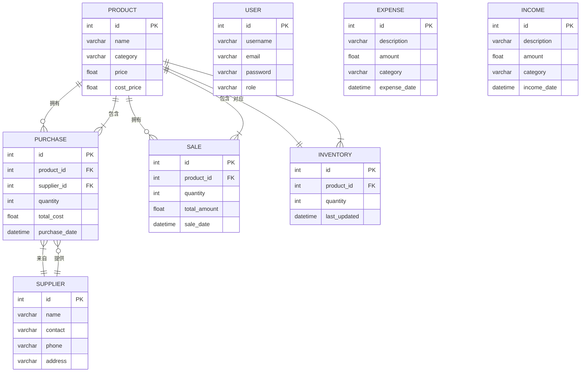

# 超市财务管理系统Mermaid图表

## 1. 系统用例图



## 2. 核心类图

```mermaid
classDiagram
    class User {
        - id: int
        - username: str
        - email: str
        - password: str
        - role: str
        + __repr__()
    }

    class Product {
        - id: int
        - name: str
        - category: str
        - price: float
        - cost_price: float
        + __repr__()
    }

    class Supplier {
        - id: int
        - name: str
        - contact: str
        - phone: str
        - address: str
        + __repr__()
    }

    class Purchase {
        - id: int
        - product_id: int
        - supplier_id: int
        - quantity: int
        - total_cost: float
        - purchase_date: datetime
        + __repr__()
    }

    class Sale {
        - id: int
        - product_id: int
        - quantity: int
        - total_amount: float
        - sale_date: datetime
        + __repr__()
    }

    class Inventory {
        - id: int
        - product_id: int
        - quantity: int
        - last_updated: datetime
        + __repr__()
    }

    class Expense {
        - id: int
        - description: str
        - amount: float
        - category: str
        - expense_date: datetime
        + __repr__()
    }

    class Income {
        - id: int
        - description: str
        - amount: float
        - category: str
        - income_date: datetime
        + __repr__()
    }

    Product -->|1:N| Purchase
    Product -->|1:N| Sale
    Product -->|1:1| Inventory
    Supplier -->|1:N| Purchase
    Purchase -->|N:1| Product
    Purchase -->|N:1| Supplier
    Sale -->|N:1| Product
    Inventory -->|1:1| Product
```

## 3. 采购流程序列图



## 4. 销售流程序列图



## 5. 生成财务报表序列图



## 6. 数据库关系图


